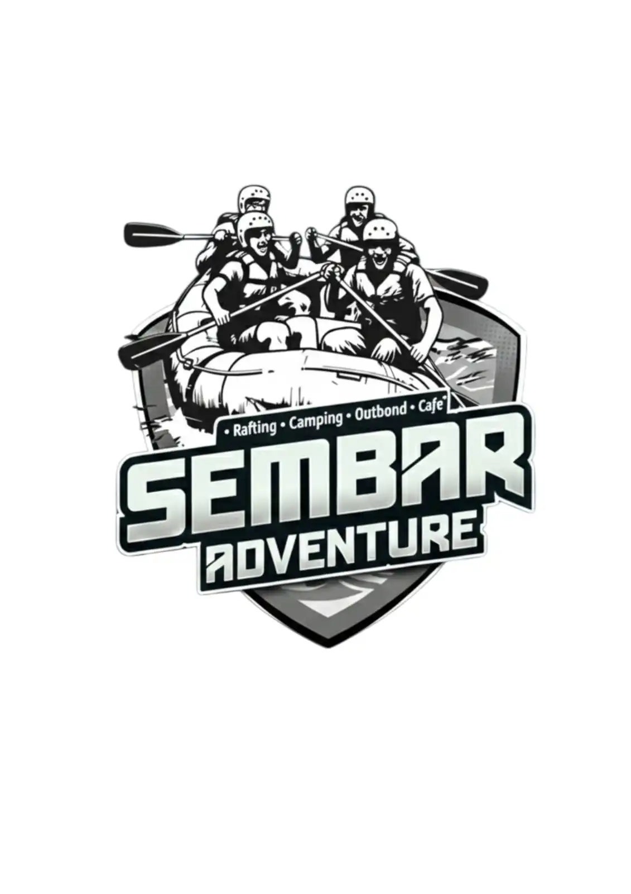

# 🌊 SEMBAR ADVENTURE - Website Arung Jeram Cisadane

Website untuk **Sembah Adventure** - wahana arung jeram di Sungai Cisadane, Bogor.



## 📍 Lokasi

**Alamat:** Jl. Lembah Cisadane Jl. H. Miing No.1a, RT.4/RW.2, Putat Nutug, Kec. Ciseeng, Kabupaten Bogor, Jawa Barat 16120

**Google Maps:** [Klik untuk melihat lokasi](https://www.google.com/maps/place/SEMBAR+ADVENTURE+(Rafting,+Outbond,Cafe)/@-6.4684479,106.6618818,17z/)

**Jam Operasional:** 
- Senin - Kamis: 10:00 - 16:30
- Jumat: Tutup
- Sabtu - Minggu: 10:00 - 16:30

---

## 🔷 Struktur Website

### 1. HOME (Landing Page)
- **Hero Section** - Background foto rafting dengan headline "SEMBAR ADVENTURE"
- **Tentang Singkat** - Deskripsi wahana arung jeram
- **Paket Rafting** - 4 card paket (Mini, Family, Panorama, Adventure)
- **Produk & Fasilitas** - Cafe, Camping, Paintball
- **Gallery** - Grid foto aktivitas
- **CTA Besar** - "Siap Berpetualang?"

### 2. PAKET RAFTING

| Paket | Jarak | Durasi | Harga | Min. Usia |
|-------|-------|--------|-------|-----------|
| Mini Rafting | 1 KM | 15 menit | Rp 600.000 | 6 tahun |
| Family Trip | 5 KM | 1 jam 20 menit | Rp 650.000 | 7 tahun |
| Panorama Trip | 7 KM | 80 menit | Rp 700.000 | 10 tahun |
| Adventure Trip | 12 KM | 2,5 jam | Rp 850.000 | 12 tahun |

*Harga per perahu (kapasitas 6 orang)*

### 3. PRODUK & FASILITAS
- Arung Jeram Cisadane
- Sembar Sunset Cafe
- Camping Ground
- Paintball

**Fasilitas:**
- Titik kumpul rafting
- Kolam renang
- Lahan parkir luas
- Lapangan outdoor

### 4. ADD-ON SERVICES

**🍽 Makan:**
- Nasi Bakar - Rp 25.000
- Nasi Goreng - Rp 25.000
- Nasi Karedok - Rp 25.000

**📸 Dokumentasi:**
- 10 Foto - Rp 150.000
- 1 Video Edit - Rp 200.000

**🥥 Minuman:**
- Es Kelapa Muda - Rp 15.000
- Es Teh Manis - Rp 8.000

### 5. BOOKING
Form booking dengan redirect ke WhatsApp:
- Nama
- No HP
- Pilih Paket
- Jumlah Peserta
- Tanggal
- Add-on (opsional)

### 6. KONTAK
- (akan ditambahkan setelah channel resmi tersedia)
- Google Maps embedded

---

## 🚀 Quick Start

```bash
# Clone repository
git clone https://github.com/IR2816/webisite-arung-jeram.git
cd webisite-arung-jeram

# Install dependencies
npm install

# Setup environment
cp .env.example .env

# Setup database
npm run db:push

# Run development server
npm run dev
```

Buka [http://localhost:3000](http://localhost:3000)

---

## 📁 Struktur Project

```
sembah-adventure/
├── prisma/
│   └── schema.prisma
├── public/images/
│   ├── Rafting/
│   │   └── webp/
│   ├── cafe/
│   ├── gallery/
│   └── packages/
├── src/
│   ├── app/
│   │   ├── api/
│   │   ├── globals.css
│   │   └── page.tsx
│   └── components/rafting/
│       ├── Animations.tsx
│       ├── AddOnSection.tsx
│       ├── BookingSection.tsx
│       ├── ContactSection.tsx
│       ├── Footer.tsx
│       ├── GallerySection.tsx
│       ├── Navbar.tsx
│       ├── PackageCard.tsx
│       └── ProductSection.tsx
├── .env.example
├── package.json
└── README.md
```

---

## ✨ Fitur

| Fitur | Status |
|-------|--------|
| Landing Page | ✅ |
| 4 Paket Rafting | ✅ |
| Produk & Fasilitas | ✅ |
| Add-On Services | ✅ |
| Gallery | ✅ |
| Form Booking | ✅ |
| WhatsApp Integration | ✅ |
| Google Maps | ✅ |
| Animasi Scroll | ✅ |
| Responsive Design | ✅ |

---

## 🛠 Tech Stack

- **Framework:** Next.js 16 (App Router)
- **Language:** TypeScript
- **Styling:** Tailwind CSS 4
- **UI:** shadcn/ui
- **Database:** SQLite (Prisma)
- **Icons:** Lucide React

---

## 📞 Kontak

Informasi kontak akan diperbarui setelah akun resmi siap.

---

© 2025 Sembah Adventure. All rights reserved.
